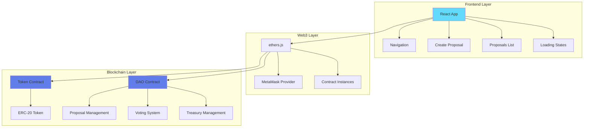
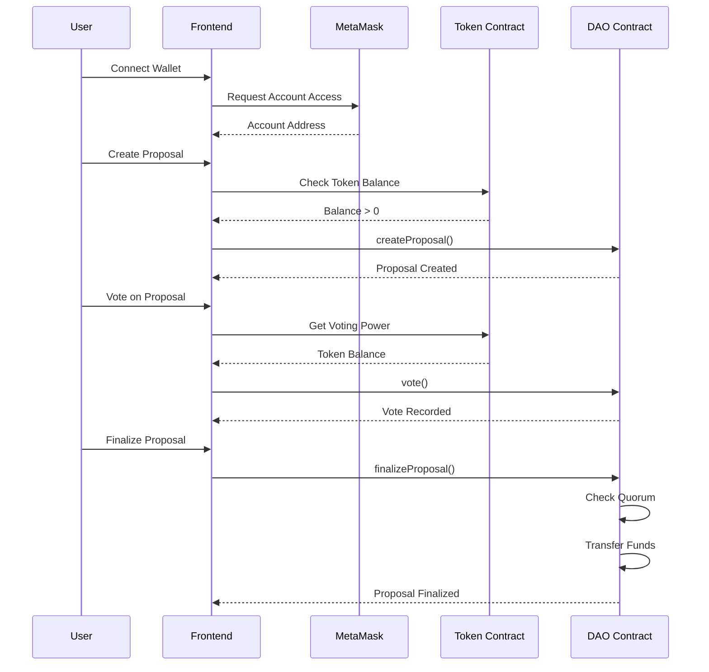

# 🏛️ Decentralized Autonomous Organization (DAO) Platform

A fully functional DAO platform built with React and Solidity, enabling decentralized governance through token-based voting mechanisms.


## 📋 Table of Contents

- [🎯 Overview](#-overview)
- [✨ Features](#-features)
- [🏗️ Architecture](#️-architecture)
- [🚀 Quick Start](#-quick-start)
- [📦 Installation](#-installation)
- [🔧 Configuration](#-configuration)
- [💻 Usage](#-usage)
- [🧪 Testing](#-testing)
- [📁 Project Structure](#-project-structure)
- [🔗 Smart Contract Details](#-smart-contract-details)
- [🌐 Frontend Components](#-frontend-components)
- [🛠️ Development](#️-development)
- [📄 License](#-license)

## 🎯 Overview

This DAO platform enables decentralized decision-making through a token-based governance system. Token holders can create proposals, vote on them, and automatically execute approved proposals through smart contracts. The platform features a modern React frontend interface for seamless interaction with the underlying Ethereum smart contracts.

### Key Highlights

- 🗳️ **Token-based Voting**: Voting power proportional to token holdings
- 💰 **Treasury Management**: Secure fund management with multi-signature-like approval
- 🎯 **Quorum System**: Minimum vote threshold for proposal execution
- 🔒 **Security**: Comprehensive access controls and reentrancy protection
- 🌐 **Web3 Integration**: Seamless MetaMask integration
- 📱 **Responsive UI**: Bootstrap-powered responsive interface

## ✨ Features

### Smart Contract Features
- ✅ Proposal creation and management
- ✅ Weighted voting based on token holdings
- ✅ Configurable quorum requirements
- ✅ Automatic fund distribution upon approval
- ✅ Anti-double voting mechanism
- ✅ Event emission for transparency

### Frontend Features
- 🎨 Modern, responsive UI with React Bootstrap
- 🦊 MetaMask wallet integration
- 📊 Real-time treasury balance display
- 📋 Proposal management interface
- 🗳️ Interactive voting system
- ⚡ Real-time transaction feedback

## 🏗️ Architecture



### System Flow



## 🚀 Quick Start

### Prerequisites
- Node.js (v14+ recommended)
- npm or yarn
- MetaMask browser extension
- Git

### Quick Setup

```bash
# Clone the repository
git clone <repository-url>
cd dao

# Install dependencies
npm install

# Start local blockchain
npx hardhat node

# Deploy contracts (in new terminal)
npx hardhat run scripts/deploy.js --network localhost

# Start the React app
npm start
```

## 📦 Installation

### 1. Clone and Install
```bash
git clone <repository-url>
cd dao
npm install
```

### 2. Environment Setup
Ensure you have the following installed:
- Node.js 14+
- MetaMask extension
- Git

### 3. Hardhat Setup
The project uses Hardhat for smart contract development:
```bash
# Compile contracts
npx hardhat compile

# Run tests
npx hardhat test
```

## 🔧 Configuration

### Smart Contract Configuration

The DAO is configured with the following parameters in `scripts/deploy.js`:

- **Token Name**: "Dapp University"
- **Token Symbol**: "DAPP"  
- **Total Supply**: 1,000,000 tokens
- **Quorum**: 500,000+ tokens (adjustable)

### Network Configuration

Update `src/config.json` with deployed contract addresses:
```json
{
  "31337": {
    "token": {
      "address": "0x5FbDB2315678afecb367f032d93F642f64180aa3"
    },
    "dao": {
      "address": "0xe7f1725E7734CE288F8367e1Bb143E90bb3F0512"
    }
  }
}
```

## 💻 Usage

### 1. Start Local Blockchain
```bash
npx hardhat node
```
This starts a local Ethereum node on `http://localhost:8545`

### 2. Deploy Contracts
```bash
npx hardhat run scripts/deploy.js --network localhost
```

### 3. Configure MetaMask
- Add Local Network: RPC URL `http://localhost:8545`, Chain ID `31337`
- Import test accounts using private keys from Hardhat node output

### 4. Start Frontend
```bash
npm start
```
Access the app at `http://localhost:3000`

### 5. Interact with DAO

#### Creating Proposals
1. Connect your MetaMask wallet
2. Ensure you hold DAO tokens
3. Click "Create Proposal"
4. Fill in proposal details:
   - Name/Description
   - Amount (in ETH)
   - Recipient address

#### Voting
1. View active proposals in the proposals table
2. Click "Vote" on desired proposals
3. Your voting power equals your token balance
4. Each address can vote only once per proposal

#### Finalizing Proposals
1. Proposals can be finalized when:
   - Votes exceed the quorum threshold
   - Proposal hasn't been finalized yet
   - DAO treasury has sufficient funds
2. Click "Finalize" to execute the proposal
3. Funds are automatically transferred to the recipient

## 🧪 Testing

The project includes comprehensive test suites for both smart contracts:

### Run Tests
```bash
# Run all tests
npx hardhat test

# Run specific test file
npx hardhat test test/DAO.js
npx hardhat test test/Token.js

# Run tests with gas reporting
REPORT_GAS=true npx hardhat test
```

### Test Coverage

#### Token Contract Tests
- ✅ Deployment and initialization
- ✅ Token transfers
- ✅ Allowance and approval mechanisms
- ✅ Transfer from functionality

#### DAO Contract Tests
- ✅ Proposal creation and validation
- ✅ Voting mechanisms and restrictions
- ✅ Quorum validation
- ✅ Proposal finalization
- ✅ Treasury management
- ✅ Access control (investor-only functions)

## 📁 Project Structure

```
dao/
├── 📁 contracts/                 # Smart contracts
│   ├── DAO.sol                  # Main DAO contract
│   └── Token.sol                # ERC-20 token contract
├── 📁 scripts/                  # Deployment scripts
│   ├── deploy.js               # Contract deployment
│   └── seed.js                 # Sample data seeding
├── 📁 test/                    # Test suites
│   ├── DAO.js                  # DAO contract tests
│   └── Token.js                # Token contract tests
├── 📁 src/                     # React frontend
│   ├── 📁 components/          # React components
│   │   ├── App.js              # Main application
│   │   ├── Navigation.js       # Header navigation
│   │   ├── Create.js           # Proposal creation
│   │   ├── Proposals.js        # Proposals display
│   │   └── Loading.js          # Loading states
│   ├── 📁 abis/               # Contract ABIs
│   │   ├── DAO.json           # DAO contract ABI
│   │   └── Token.json         # Token contract ABI
│   ├── config.json            # Contract addresses
│   ├── index.js               # React entry point
│   └── index.css              # Global styles
├── 📁 public/                  # Static assets
├── 📁 artifacts/               # Compiled contracts
├── 📁 cache/                   # Hardhat cache
├── hardhat.config.js           # Hardhat configuration
├── package.json               # Dependencies
└── README.md                  # Documentation
```

## 🔗 Smart Contract Details

### Token Contract (`Token.sol`)

**Purpose**: ERC-20 compatible token used for governance voting

**Key Functions**:
- `transfer(address _to, uint256 _value)`: Transfer tokens
- `approve(address _spender, uint256 _value)`: Approve spending
- `transferFrom(address _from, address _to, uint256 _value)`: Transfer on behalf

**Features**:
- Standard ERC-20 implementation
- 18 decimal precision
- Total supply of 1,000,000 tokens
- Transfer and approval events

### DAO Contract (`DAO.sol`)

**Purpose**: Main governance contract handling proposals and voting

**Key Functions**:
- `createProposal(string _name, uint256 _amount, address _recipient)`: Create new proposal
- `vote(uint256 _id)`: Vote on proposal (token holders only)
- `finalizeProposal(uint256 _id)`: Execute approved proposal

**Key Features**:
- Token-weighted voting system
- Configurable quorum requirements
- Anti-double voting protection
- Automatic fund distribution
- Event emission for transparency

**Access Control**:
- `onlyInvestor` modifier: Restricts functions to token holders
- Proposal finalization requires quorum approval
- Prevents re-voting on same proposal

## 🌐 Frontend Components

### App.js
- **Purpose**: Main application orchestrator
- **Features**: 
  - Web3 provider initialization
  - Contract instance management
  - Account connection handling
  - Treasury balance monitoring

### Navigation.js  
- **Purpose**: Header navigation and wallet connection
- **Features**:
  - Account address display
  - MetaMask connection status
  - Responsive design

### Create.js
- **Purpose**: Proposal creation interface
- **Features**:
  - Form validation
  - Transaction handling
  - Error feedback
  - Loading states

### Proposals.js
- **Purpose**: Proposal listing and interaction
- **Features**:
  - Tabular proposal display
  - Vote and finalize buttons
  - Real-time status updates
  - Conditional button rendering

## 🛠️ Development

### Local Development Setup

1. **Terminal 1**: Start blockchain
```bash
npx hardhat node
```

2. **Terminal 2**: Deploy contracts
```bash
npx hardhat run scripts/deploy.js --network localhost
```

3. **Terminal 3**: Start frontend
```bash
npm start
```

### Development Workflow

1. **Smart Contract Changes**:
   - Modify contracts in `contracts/`
   - Run tests: `npx hardhat test`
   - Redeploy: `npx hardhat run scripts/deploy.js --network localhost`
   - Update contract addresses in `src/config.json`

2. **Frontend Changes**:
   - Modify components in `src/components/`
   - Changes auto-reload with React hot reloading

3. **Testing Strategy**:
   - Write tests for new contract functions
   - Test frontend components manually
   - Verify MetaMask integration

### Common Development Commands

```bash
# Compile contracts
npx hardhat compile

# Run tests with coverage
npx hardhat test

# Deploy to testnet
npx hardhat run scripts/deploy.js --network goerli

# Verify contracts (if needed)
npx hardhat verify --network goerli <contract-address>

# Start frontend development server
npm start

# Build for production
npm run build
```

## 🤝 Contributing

1. Fork the repository
2. Create a feature branch (`git checkout -b feature/amazing-feature`)
3. Commit your changes (`git commit -m 'Add amazing feature'`)
4. Push to the branch (`git push origin feature/amazing-feature`)
5. Open a Pull Request

## 📄 License

This project is licensed under the ISC License - see the [LICENSE](LICENSE) file for details.

## 🙏 Acknowledgments

- Built with [Hardhat](https://hardhat.org/) development environment
- Frontend powered by [React](https://reactjs.org/) and [Bootstrap](https://getbootstrap.com/)
- Web3 integration via [ethers.js](https://docs.ethers.io/)
- Inspired by decentralized governance principles

---

**Made with ❤️ for the decentralized future**

*Contact: expositogonzalez.juanjose@gmail.com*
